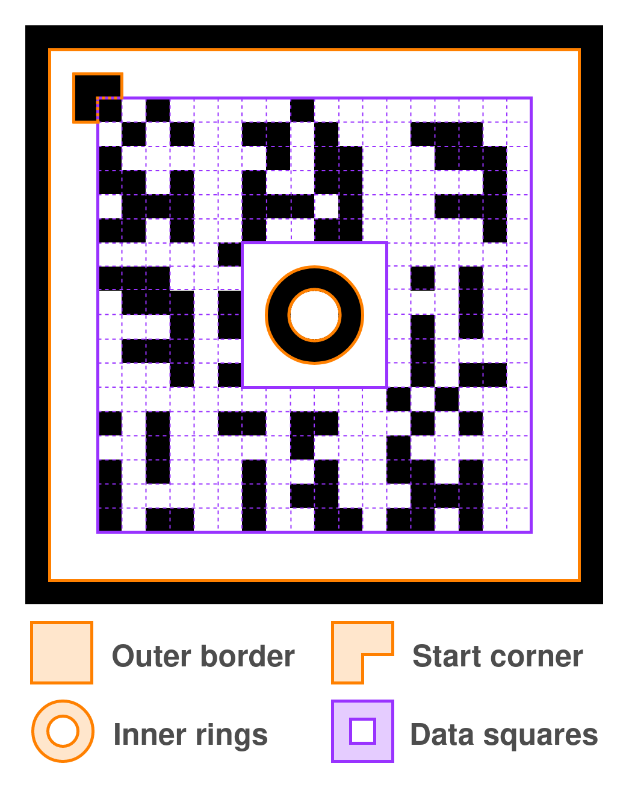

<p align="center">
  
</p>

# A (much) simplified QR code

## But why?

I was taking a course about computer vision when I got the idea to design my own simplified QR code. I didn't want to create yet another QR code reader but rather create something of my own. SR is a tongue-in-cheek acronym for `Sufficient Response`, since QR stands for `Quick Response` (atleast that's what wikipedia tells me). Also a disclaimer, I haven't really looked deep into how a standard QR code works. This project is trying to only visually imitate a QR code, not neccessarily use the same algorithms.

## Examples

## How do I use this?

Clone the repo, create a virtual environment and install as a dev package:

```bash
git clone --depth=1 https://github.com/tomasr8/SR-Code.git
cd SR-Code

python -m venv .venv
source .venv/bin/activate

pip install -r requirements.txt
pip install -e .
```

To use it:

```bash
# Create a 600x600 SR code which encodes 'Hello world!'
sr generate -s 600 -m 'Hello world!' hello.png
# Decode an SR code from an image
sr decode hello.png
# Decode from a video
sr video video.mp4
# Alternatively use the system camera
sr video
```

For help:

```bash
sr --help
```

## How does it actually work?
if you wanna see a detailed explantaion, skip to [Design](#Design).



Let's assume we start with a standard color image that includes the QR code somewhere inside of it. Before we do any decoding we must first locate it.

- image

To do this I use OpenCV to find contours in the image. A contour is a closed shape which separates two regions. For this to work the image has to be converted to black & white:

- image

Once we have found a candidate we get rid of any possible distorition:

- image

Now we verify that we actually have a QR code on our hands by trying to locate the inner rings:

- image

Once we have those, we find the start corner. The start corner tells where to start reading the data:

- image

Finally, we read the data. A black square encodes the bit 1 and white encodes 0.

- image

- First, we convert the image into a binary black & white image using Otsu's method
- Next, we use OpenCV's function to find candidate contours which are processed to select likely candidates.
- Each contour is mapped using a homography to remove any distortions
- To make sure we actually have a qr code on our hands, we check for the presents of the circles at the center. There are a lot of rectangular objects in the wild, so this helps firlter out unlikely candidates.
- Next, we look for the starting corner so that we know where to start reading from.
- Finally we just read the cells in the data area. This data duplicated 3 times so we use majority voting to correct any errors.

## Design

I tried to keep the design as simple as possible.

### Encoding

The SR Code can encode up to 16 characters from this character set: ...
The size of the set is 64 which is 2^6 which means that we can encode every character as a sequence of 6 bits. The total number of bits we can fit is 16 _ 6 _ 3=288

This encoding scheme is pretty inefficient and it's possible to use more advanced encoding algorithms which would let you fit longer messages.

### Normalization

Once we have the start corner, we rotate the qr code so that the start corner is in the top left. Then, we just read the data column by column, skipping the middle part reserved for the circles.

Why the rings? It's a pretty specific shape which is unlikely to appear randomly unless we're dealing with an actual qr code. It's also symmetrical so we can check for it regardless of the orientation the code.

## Limitations


- Maximum 16 characters from this character set:

This is the result of the encoding scheme/ I had 288 bits to work with which leaves 288/3=96 bits for the message. Using base64, I can encode one character in 6 bits, thus 96/6=16 total characters.
